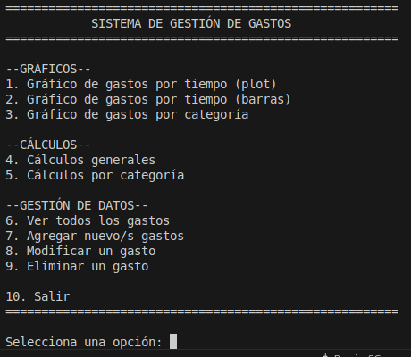
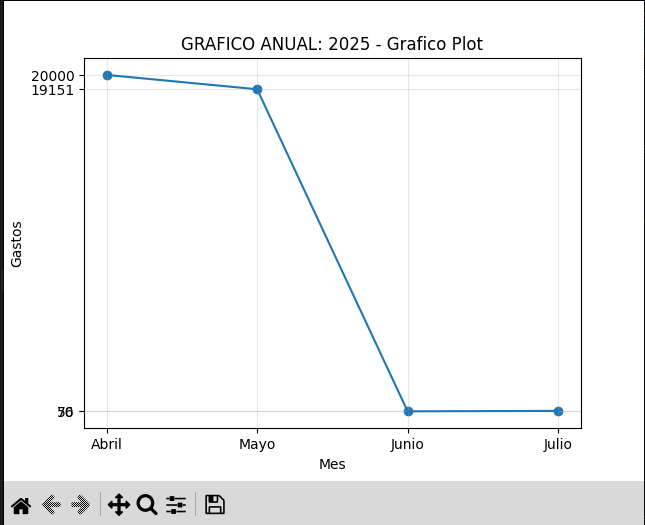
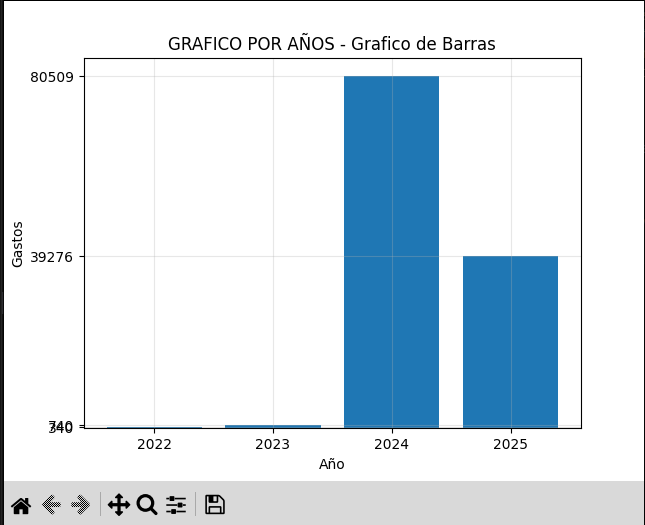
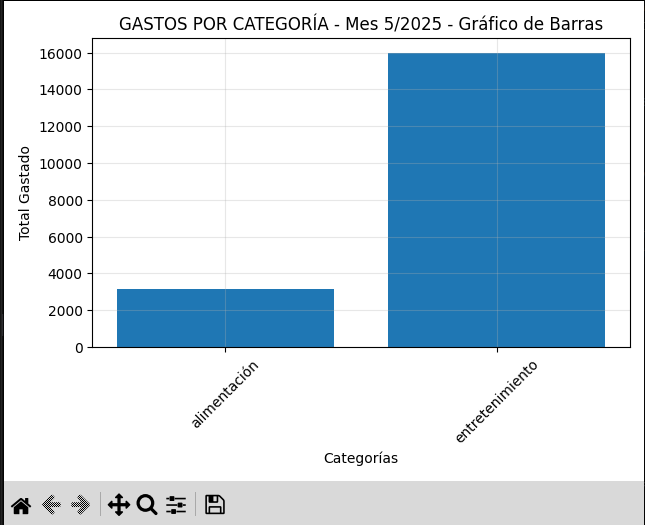
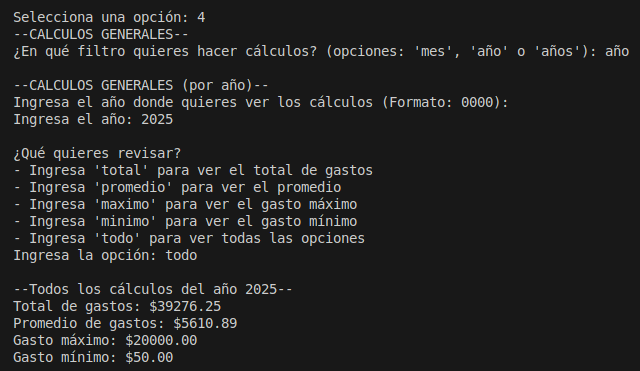
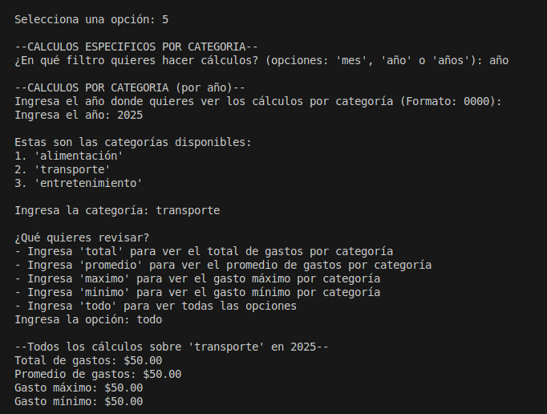
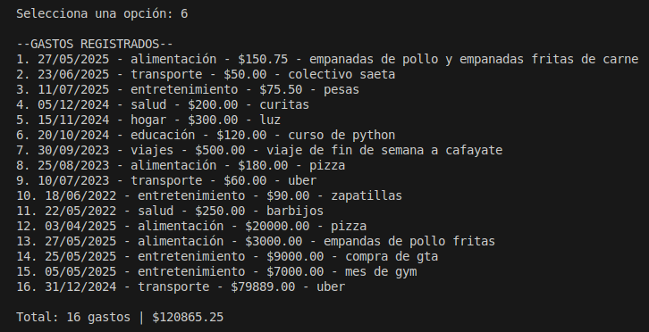
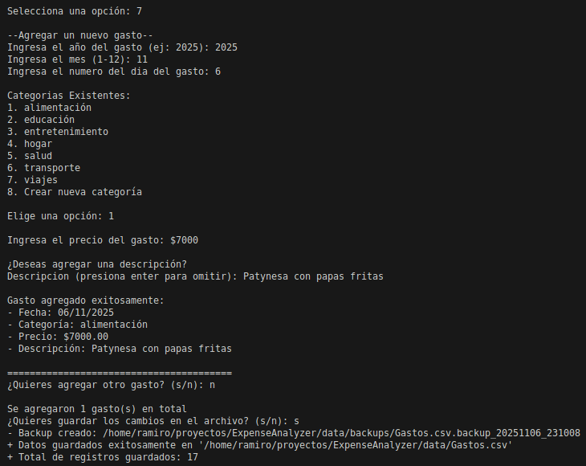

# 📊 Sistema de Gestión de Gastos Personales

[](https://www.python.org/)
[](https://numpy.org/)
[](https://matplotlib.org/)
[](https://opensource.org/licenses/MIT)

Sistema interactivo de análisis y gestión de gastos personales desarrollado en Python. Permite registrar, visualizar y analizar gastos mediante gráficos estadísticos y cálculos detallados.

> **Nota:** Este proyecto fue desarrollado como Trabajo Final de la materia **Programación 2** del segundo semestre de primer año en la carrera **Licenciatura en Ciencias de Datos** en la **Universidad Católica de Salta (UCASAL)**.

---

## 📋 Tabla de Contenidos

- [Características](#-características)
- [Tecnologías Utilizadas](#-tecnologías-utilizadas)
- [Instalación](#-instalación)
- [Uso](#-uso)
- [Estructura del Proyecto](#-estructura-del-proyecto)
- [Funcionalidades Principales](#-funcionalidades-principales)
- [Capturas de Pantalla](#-capturas-de-pantalla)
- [Autor](#-autor)
- [Licencia](#-licencia)

---

## ✨ Características

- **CRUD Completo**: Crear, leer, actualizar y eliminar gastos
- **Visualizaciones Gráficas**: 
  - Gráficos de línea (plot) para tendencias temporales
  - Gráficos de barras para comparaciones
  - Análisis por categorías
- **Análisis Estadístico**: 
  - Cálculos de suma, promedio, máximo y mínimo
  - Filtrado por mes, año o histórico completo
- **Sistema de Backups Automáticos**: Respaldo de datos antes de cada modificación
- **Validación de Datos**: Validación robusta de fechas, precios y categorías
- **Arquitectura Modular**: Código organizado en módulos separados para mejor mantenibilidad

---

## 🛠️ Tecnologías Utilizadas

- **Python 3.12**: Lenguaje de programación principal
- **NumPy**: Cálculos estadísticos y manejo de arrays
- **Matplotlib**: Generación de gráficos y visualizaciones
- **CSV**: Almacenamiento de datos en formato estructurado
- **Módulos estándar**: `calendar`, `datetime`, `os`, `shutil`

---

## 📥 Instalación

### 1. Clonar el repositorio
```bash
git clone https://github.com/TU-USUARIO/TU-REPO.git
cd TU-REPO
```

### 2. Crear un entorno virtual (recomendado)
```bash
python -m venv venv

# En Windows:
venv\Scripts\activate

# En Linux/Mac:
source venv/bin/activate
```

### 3. Instalar dependencias
```bash
pip install -r requirements.txt
```

---

## 🚀 Uso

### Ejecutar el programa

Desde la raíz del proyecto:
```bash
python src/main.py
```

### Menú Principal

El sistema presenta un menú interactivo con las siguientes opciones:
```
SISTEMA DE GESTIÓN DE GASTOS

--GRÁFICOS--
1. Gráfico de gastos por tiempo (plot)
2. Gráfico de gastos por tiempo (barras)
3. Gráfico de gastos por categoría

--CÁLCULOS--
4. Cálculos generales
5. Cálculos por categoría

--GESTIÓN DE DATOS--
6. Ver todos los gastos
7. Agregar nuevo/s gastos
8. Modificar un gasto
9. Eliminar un gasto

10. Salir
```

## 📸 Capturas de Pantalla

### Menú Principal

<p align="center">
  
</p>

### Gráficos de Análisis

**Gráfico de línea - Ejemplo**
<p align="center">
  
</p>

**Gráfico de barras - Ejemplo**
<p align="center">
  
</p>

**Gráfico por categorias - Ejemplo**
<p align="center">
  
</p>

### Calculos

**Calculos Generales - Ejemplo**
<p align="center">
  
</p>

**Calculos por Categoría - Ejemplo**
<p align="center">
  
</p>

### Gestion de Gastos

**Ver Todos los Gastos**
<p align="center">
  
</p>

**Agregar nuevos gastos - Ejemplo**
<p align="center">
  
</p>

---

## 📁 Estructura del Proyecto
```
EXPENSEANALYZER/
│
├── .gitignore              # Archivos ignorados por Git
├── LICENSE                 # Licencia MIT
├── requirements.txt        # Dependencias del proyecto
├── README.md               # Documentación
│
├── data/                   # Datos del proyecto
│   ├── Gastos.csv          # Archivo principal de gastos
│   └── backups/            # Backups automáticos
│
└── src/                    # Código fuente
    ├── __init__.py         # Inicializador del paquete
    ├── main.py             # Punto de entrada del programa
    ├── config.py           # Configuración de rutas
    ├── analisis_datos.py   # Lectura de datos CSV
    ├── graficos.py         # Funciones de visualización
    ├── calculos.py         # Funciones de cálculo estadístico
    ├── crud.py             # Operaciones CRUD
    └── utilidades.py       # Funciones auxiliares
```

---

## 🎯 Funcionalidades Principales

### 1. Gestión de Gastos (CRUD)

- **Agregar**: Registro de nuevos gastos con validación de datos
- **Ver**: Listado completo de gastos con totales
- **Modificar**: Edición de gastos existentes
- **Eliminar**: Borrado con confirmación

### 2. Visualizaciones

- **Gráficos temporales**: Análisis de gastos por día, mes o año
- **Gráficos por categoría**: Distribución del gasto por categorías
- **Múltiples tipos**: Plot lineal y gráficos de barras

### 3. Análisis Estadístico

- **Filtros flexibles**: Por mes específico, año o histórico completo
- **Estadísticas**: Total, promedio, máximo y mínimo
- **Por categoría**: Análisis detallado de cada tipo de gasto

### 4. Sistema de Backups

- Creación automática de respaldos antes de cada modificación
- Nomenclatura con timestamp: `Gastos.csv.backup_YYYYMMDD_HHMMSS`
- Almacenamiento organizado en carpeta dedicada

---

## 👨‍💻 Autor

**Ramiro Sebastian Gaspar**

- Universidad: Universidad Católica de Salta (UCASAL)
- Carrera: Licenciatura en Ciencias de Datos
- Materia: Programación 2 - Segundo Semestre (Primer Año)
- GitHub: [@RamiroSGaspar](https://github.com/RamiroSGaspar)

---

## 📄 Licencia

Este proyecto está bajo la Licencia MIT - ver el archivo [LICENSE](LICENSE) para más detalles.

---